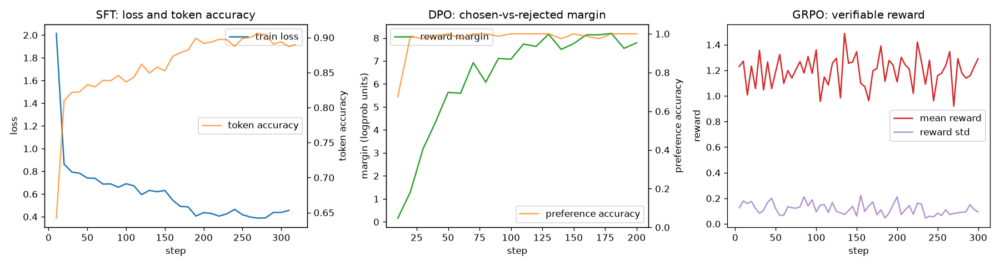
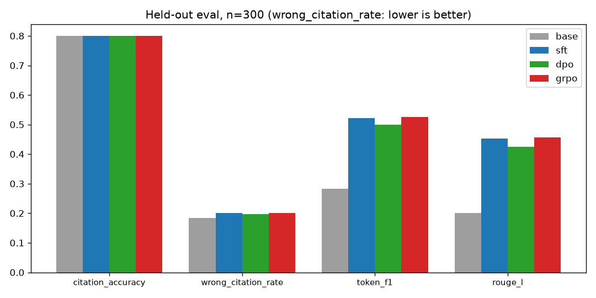
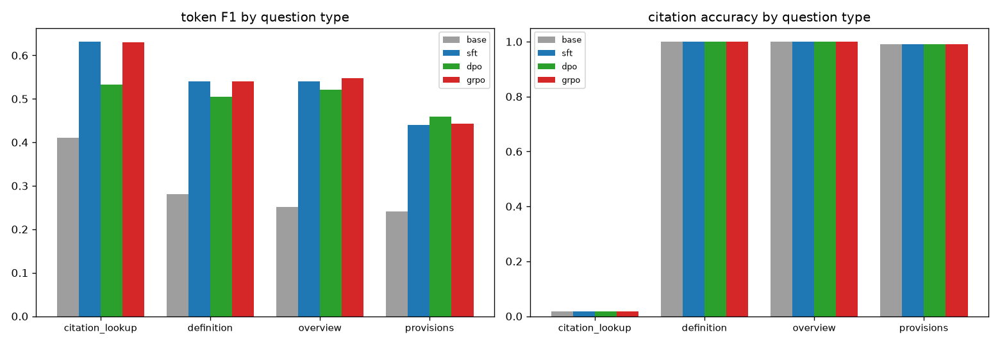

# eCFR Title 12 Regulation Assistant — LoRA Post-Training Pipeline

**New: Phase 1 corpus and continued pretraining.** See [PHASE1.md](PHASE1.md)
for the isolated, audited full-corpus experiment comparing base Instruct with
continued pretraining, configured in `phase1.json`. The results below belong to
the earlier post-training experiment, not the new continued-pretraining run.
Phase 1 supports NVIDIA CUDA and Apple Silicon MPS, with an M5 Pro setup guide
and a separate `phase1.mac.json` configuration in [PHASE1.md](PHASE1.md).

Fine-tunes **Llama-3.1-8B-Instruct** into a grounded banking-regulation
assistant for Title 12 of the Code of Federal Regulations (OCC, Chapter I),
and compares three post-training methods — **SFT**, **DPO**, and **GRPO** —
against the untuned base model on a leakage-guarded held-out set.

```text
download → build → SFT → DPO → GRPO → eval → report
```

| | |
|---|---|
| Data source | Point-in-time eCFR snapshot (2025-01-01), official versioner API |
| Dataset | 2,539 SFT examples / 1,606 DPO pairs / 200 held-out eval examples |
| Adapters | LoRA r=16 on all attention + MLP projections (shared config) |
| Hardware | Single NVIDIA A40 (bf16 LoRA; auto-switches to 4-bit QLoRA < 40 GB VRAM) |
| Models | [SFT](https://huggingface.co/abubakarilyas624/ecfr-title12-llama31-8b-sft) · [DPO](https://huggingface.co/abubakarilyas624/ecfr-title12-llama31-8b-dpo) · [GRPO](https://huggingface.co/abubakarilyas624/ecfr-title12-llama31-8b-grpo) |

## Training results



- **SFT** (2 epochs, 318 steps): loss 2.0 → 0.45, token accuracy 64% → 89%.
- **DPO** (1 epoch on corruption pairs): preference accuracy reaches ~100%,
  chosen-vs-rejected reward margin grows to ~8 logprob units — the model
  cleanly separates correct+cited answers from wrong-section / wrong-citation /
  vague corruptions.
- **GRPO** (300 steps, verifiable rewards, no reward model): mean reward stable
  around 1.2 of a ~2.0 practical maximum. The policy starts from SFT, which
  already cites well — GRPO refines rather than rediscovers.

## Evaluation

Four checkpoints (base, SFT, DPO, GRPO) answer the **same 200 held-out
questions** with greedy decoding. Sections are split by stable hash before
question generation, and build-time assertions guarantee no section or prompt
crosses from train into test.

**Metrics** — `citation_accuracy` (predicted § matches target),
`wrong_citation_rate` (confidently cites the wrong § — lower is better),
`token_f1` and `rouge_l` against grounded reference answers.



### Per question type

The eval set spans four question types: `overview` ("what does § X cover?"),
`provisions` ("summarize key provisions"), `citation_lookup` ("which section
addresses 'X'?" — the only type where the citation is *not* given in the
prompt), and `definition` ("how does § X define 'Y'?").



Full numbers with deltas: [RESULTS.md](RESULTS.md) · scored details:
`results/eval_results.json` · stakeholder PDF: `results/model_report.pdf`.

## Method comparison

| Stage | Signal | What it teaches |
|---|---|---|
| SFT | Correct answer per prompt | Task format, terminology, citation habit |
| DPO | Chosen vs corrupted answer | Prefer correct citations over confident errors |
| GRPO | Verifiable reward on sampled answers | Optimize citation/grounding/brevity directly |

DPO and GRPO both initialize from the SFT adapter, so results isolate what
each method adds over the same supervised start. Design rationale, leakage
guards, corruption taxonomy, and known evaluation limitations:
[DESIGN.md](DESIGN.md).

## Reproduce

```bash
pip install -r requirements.txt
cp .env.example .env            # add your HF_TOKEN

python training_models_v1.py all             # download → build → sft → dpo → eval → report
python training_models_v1.py grpo            # optional RL stage (~3-4x SFT cost)
python train_and_upload.py --upload-only --stage sft  # retry a completed adapter upload

# validate the whole loop first for cents:
python training_models_v1.py all --smoke
```

Every stage writes a manifest (config hash, seed, library versions, dataset
SHA-256) to `outputs/manifests/`, so any result can be traced to the exact
inputs that produced it.

Full CPT, SFT, DPO, and GRPO runs now automatically publish their final adapters
and tokenizers to private Hugging Face repositories, one name per artifact
fingerprint. Authenticate with `hf auth login` before training. Smoke runs stay
local. See [publishing and loading instructions](PHASE1.md#save-every-trained-model-to-hugging-face)
for configuration, saved revision receipts, and upload retries.

## Repository map

```text
config.yaml               all knobs (model, data, LoRA, per-stage hyperparameters)
training_models_v1.py     stage CLI (download/build/sft/dpo/grpo/eval/report)
train_and_upload.py       train + publish to Hugging Face Hub
ecfr_pipeline/            pipeline stages and shared utilities
scripts/                  RESULTS.md and chart generators
demo_comparison.ipynb     side-by-side base/SFT/DPO/GRPO answers
model-comparison-ui/      RegBench web UI: live comparisons, history, metrics, presentation mode
model_gateway.py          local OpenAI-compatible server for base/CPT/SFT/DPO/GRPO adapters
run_regbench_gateway.sh   safely starts the local gateway after training releases the GPU
DESIGN.md                 design decisions and evaluation limitations
data/dataset_card.md      dataset provenance, splits, artifact hashes
```

## Interactive model comparison

The private RegBench UI can compare two to five checkpoints on the same prompt,
record expected-citation accuracy and reference-answer token F1, save history,
aggregate results, mark a human-preferred answer, and show a presentation view.

For Hugging Face-hosted inference, open **Models** and enter either a model ID
served by an Inference Provider or a dedicated Inference Endpoint URL. LoRA
adapter repositories normally need dedicated endpoints.

For inference on the training GPU, wait until `run_all.sh` finishes, then run:

```bash
tmux new -s regbench-gateway
cd /root/ecfr-title12-finetuning
./run_regbench_gateway.sh
```

The gateway serves an OpenAI-compatible API at `http://127.0.0.1:8090` and
loads only one checkpoint at a time. This allows all stages to fit on one GPU.
Its `/health` response shows which adapters are complete. In a local UI checkout,
copy `model-comparison-ui/.dev.vars.example` to `.dev.vars`, configure the token,
and select `local://base`, `local://cpt`, `local://sft`, `local://dpo`, or
`local://grpo` as the corresponding endpoint.

## Disclaimer

Research project. Answers are generated from a dated regulatory snapshot and
must not be treated as legal advice; verify against the current eCFR.
